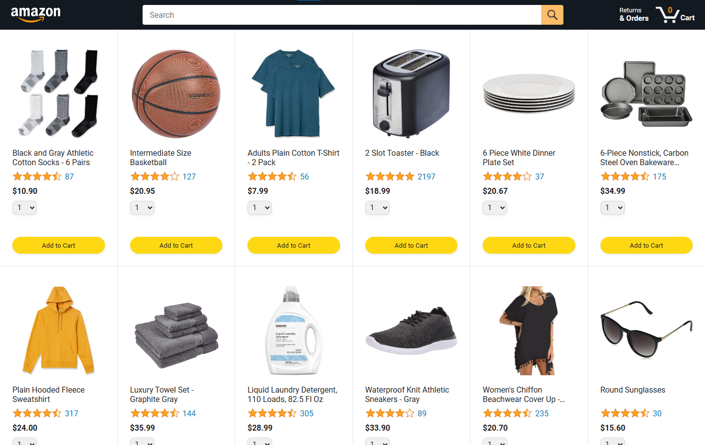

# Amazon Clone Static Website

## Connecting HTML and CSS with Javascript practice project by following the youtube course --> https://www.youtube.com/watch?v=TmcEmsyYKXE&list=PLEPye7A7EcQZrT3VSBb7jtxnxIfY3yyG6&index=4

### Completed UI Look:

## To use the website
* Click the link: https://aron-arboleda.github.io/AmazonClone/